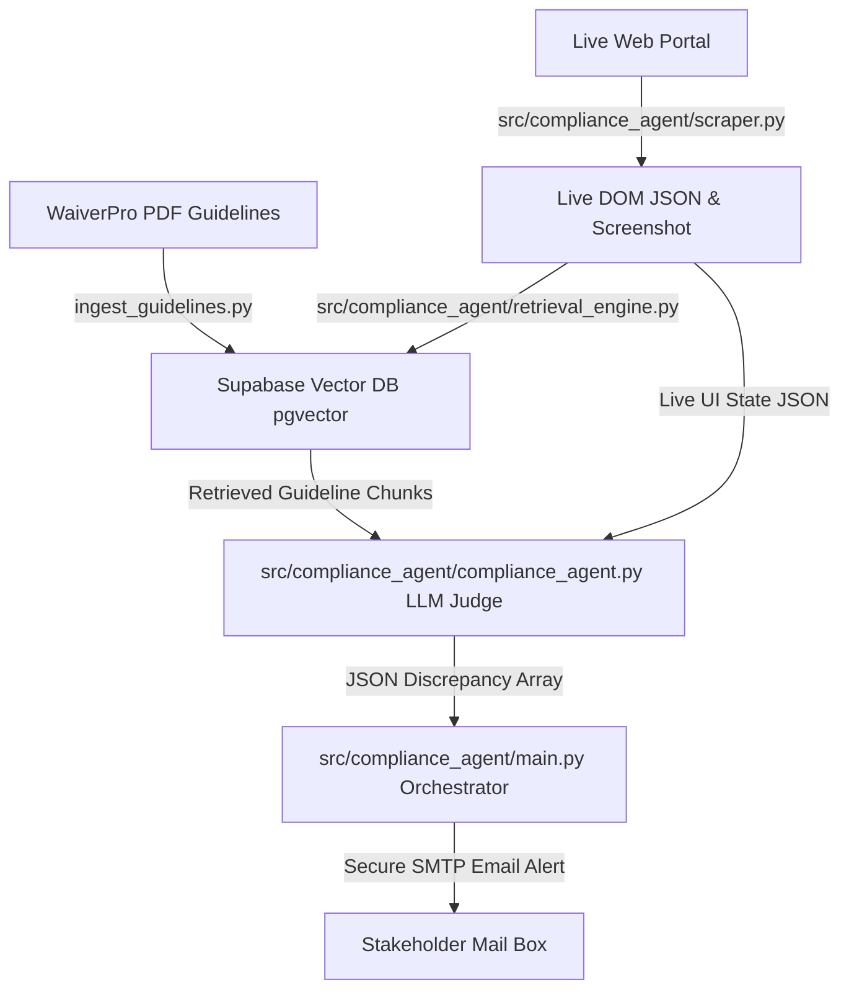

# WaiverPro Documentation Compliance Automation Agent

A production-ready Python compliance automation system that automatically verifies if a live web application conforms to its official design and functional guidelines. The system ingests a guideline PDF document, indexes it into a Supabase Vector DB (pgvector), crawls the live web portal's UI views using a headless browser, retrieves relevant rules via RAG, audits pages for discrepancies using an LLM compliance judge, and sends secure SMTP email alerts with styled HTML summaries and screenshots.

---

## 📐 Core Architecture & Components



The codebase is organized into an enterprise-grade package structure under the `src/` directory with thin, root-level execution wrappers:

### 1. Root Level Entrypoints
*   **`main.py`**: Thin orchestrator entrypoint wrapper. Launches the compliance sweep pipeline.
*   **`ingest_guidelines.py`**: Thin ingestion entrypoint wrapper. Parses and embeds the guidelines PDF.
*   **`auto_healer.py`**: Thin healer entrypoint wrapper. Applies LLM patches to codebases based on compliance findings.

### 2. Core Python Package (`src/compliance_agent/`)
*   **`main.py`**: Master orchestrator logic. Runs sequential audits, filters baselines, compiles unified reports, and triggers SMTP alerts.
*   **`compliance_agent.py`**: RAG compliance judge. Connects to Hugging Face Serverless APIs, filters DOM boundaries, and runs structural JSON checks.
*   **`scraper.py`**: playwrighter browser session controller. Performs authenticated page scrapes and captures layout JSON files.
*   **`retrieval_engine.py`**: Queries pgvector similarity matches via Supabase RPC queries with built-in retry backoff.
*   **`ingest_guidelines.py`**: Splitting, chunking, and embedding guidelines using SentenceTransformers and Supabase.
*   **`github_client.py`**: GitHub REST API client wrapper.
*   **`auto_healer.py`**: Patch repair engine that heals target source components.

### 3. Verification & Mock Components
*   **`tests/`**: Directory containing consolidated automated test suites (`test_compliance.py`).
*   **`src/components/FacilitiesTable.js`**: Mock React component containing guideline schemas for validation testing.
*   **`dashboard/`**: Next.js client monitoring dashboard app.

## 🌟 Key System Features

The WaiverPro Compliance system includes several enterprise-grade optimizations to ensure speed, accuracy, and operational reliability:

*   **Dynamic Model Routing**: Routes LLM compliance audits based on captured DOM footprint complexity:
    *   *Bypass Route*: Bypasses LLM calls completely if RAG retrieved zero matching rules for the active page, saving computational budget.
    *   *Low-Latency Route (`Qwen2.5-1.5B`)*: Routes smaller page states (< 12k characters) to the lightweight 1.5B model for rapid execution (**~200ms–500ms**).
    *   *High-Reasoning Route (`Qwen2.5-7B`)*: Routes complex layout states to the 7.6B model for deep analytical checks.
*   **Explainable Compliance Citations**: Enforces the extraction of standard PDF rule references (`guideline_reference`) inside compliance judge reports.
*   **Operational Error Separation**: Distinguishes pipeline, authentication redirection, and API rate limit failures from actual compliance violations, marking them as `infrastructure_error`.
*   **Baselines Style Regression Testing**: Conducts normalized text and structural style regression tests against visual caches (`visual_baselines.json`).
*   **SMTP Alert Cooldown Idempotency**: Suppresses alert email flood by checking run history in `.last_sent_alert.json` and skipping duplicate reports within a 1-hour window.
*   **Global Model Caching**: Caches model weights dynamically inside a global memory dictionary (`_MODEL_CACHE`) to avoid loading embedding models per-page.
*   **Supabase RPC Connection Retries**: Uses a 3-attempt exponential backoff retry wrapper to handle transient Supabase network disruptions.

---

## 🚀 Setup & Installation

### 1. Prerequisites
- Python 3.10+
- A Supabase Project
- A Hugging Face account and Access Token

### 2. Environment Setup
Clone the repository and initialize the Python virtual environment:
```bash
# Clone the repository
git clone https://github.com/karnamvenkatachaitanya/Novulis.git
cd Novulis

# Create and activate virtual environment
python -m venv venv
.\venv\Scripts\activate

# Install dependencies
pip install -r requirements.txt
playwright install chromium
```

### 3. Supabase Schema Setup
1. Go to your [Supabase SQL Editor](https://supabase.com/dashboard/).
2. Copy the content of **[`database_setup.sql`](database_setup.sql)**, paste it into the editor, and click **Run**.

### 4. Configuration
Create a `.env` file in the root directory:
```env
# Live Web Portal
APP_BASE_URL=https://white-cliff-0bca3ed00.1.azurestaticapps.net
APP_LOGIN_PATH=/login
APP_LOGIN_EMAIL=admin@gmail.com
APP_LOGIN_PASSWORD=password

# Supabase Vector DB
SUPABASE_URL=https://klbidsgkllnsrijszzas.supabase.co
SUPABASE_KEY=your_publishable_anon_key
SUPABASE_SERVICE_ROLE_KEY=your_secret_service_role_key

# Hugging Face token (for Inference API client)
HF_TOKEN=your_hugging_face_token

# Email Server (SMTP Gmail Example)
SMTP_HOST=smtp.gmail.com
SMTP_PORT=587
SMTP_USERNAME=your_gmail@gmail.com
SMTP_PASSWORD=your_gmail_app_password
ALERT_FROM=your_gmail@gmail.com
ALERT_TO=your_gmail@gmail.com
```

---

## 🛠️ Usage Instructions

### Step 1: Ingest Guidelines
Parse and upload the official PDF guidelines into Supabase:
```bash
python ingest_guidelines.py --pdf WaiverPro-User-Guidelines-WITH-DISCREPANCIES.pdf --verbose
```

### Step 2: Execute Orchestrated Compliance Sweep
Run the end-to-end scraper, RAG retrieval, AI auditing, and email alert pipeline:
```bash
python main.py --similarity-threshold 0.0 --smtp-starttls --verbose
```

### Step 3: Run Automated Unit Tests
Verify package logic, DOM filter bounds, and RAG routing functions using the test suite:
```bash
python -m unittest tests/test_compliance.py
```

---

## 📐 Design Decisions & Trade-offs

- **Playwright Scraper (Selected)**: Playwright was chosen over Selenium and Puppeteer for its superior state caching (native context storage for `auth_state.json`), reliable async scheduling, and robust selector-based element visibility checks.
- **Supabase Vector DB (Selected)**: Chosen over Pinecone or FAISS for the advantage of pgvector being directly integrated within a PostgreSQL engine, allowing combined SQL filtering (matching `url_path`) and HNSW vector calculations in a single query transaction.
- **Serverless HF Inference API (Selected)**: Replaced local Mistral-7B execution with serverless Hugging Face endpoints running `Qwen/Qwen2.5-7B-Instruct` to guarantee reliable operation on resources-constrained hardware, avoiding OOM (Out Of Memory) states and local GPU requirements.
- **STARTTLS with Increased Mail Timeout**: Set timeout to `300` seconds to guarantee transmission of emails containing visual page evidence attachments (e.g. unified PDF report) without blocking thread contexts.

---

## ⚠️ Limitations & Future Improvements
- **Shadow DOM support**: The current custom element extractor parses standard page structures but would require extensions to inspect shadow roots.
- **Multi-step Form Auditing**: Current scraper targets static tab views; a future enhancement would support form-filling walkthroughs (e.g. submitting a new waiver application in-page).
