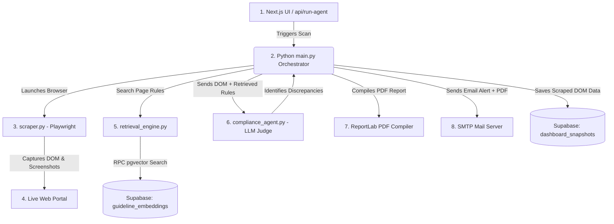
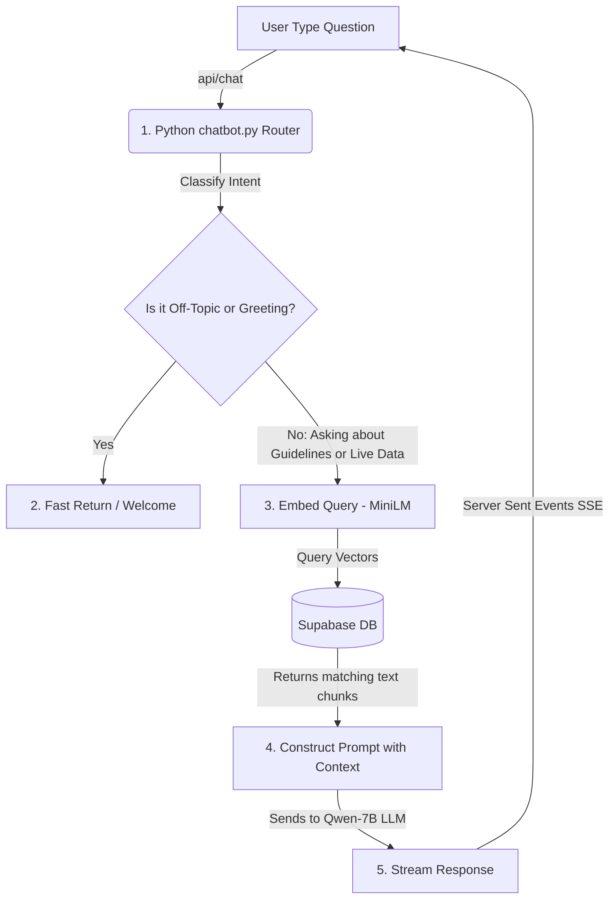
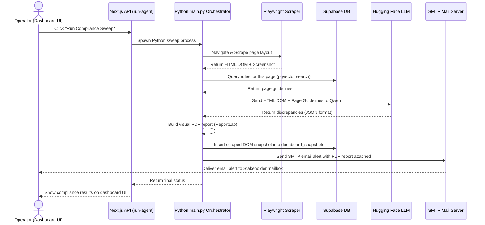
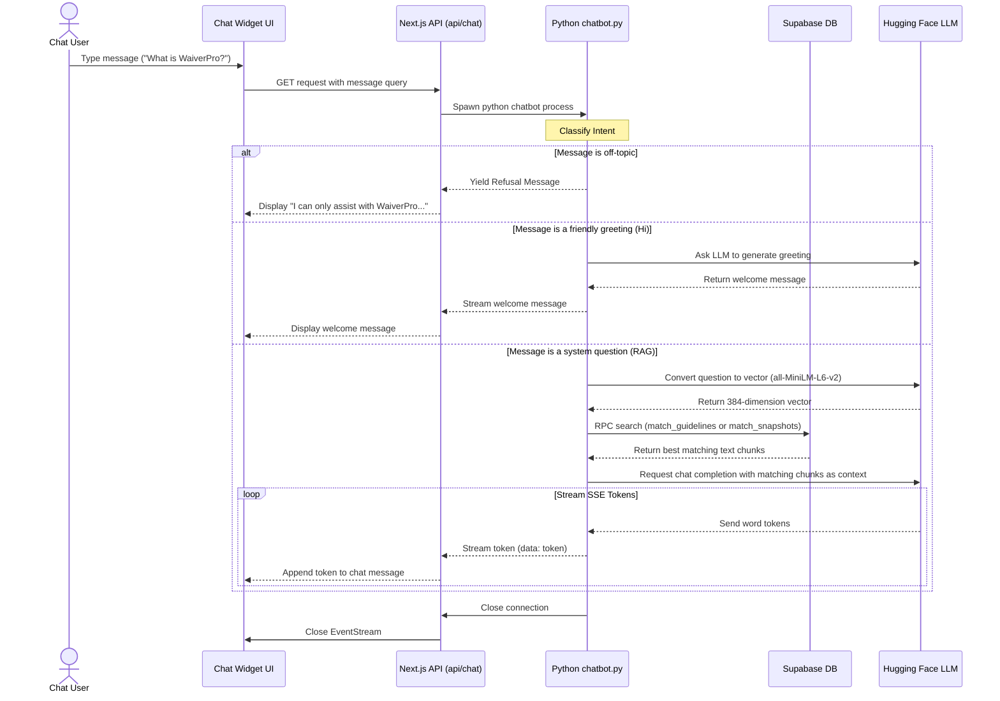

# WaiverPro Compliance Automation Suite & RAG Monitoring Dashboard

🔗 **Live App on Hugging Face Spaces**: [https://venkatachaitanya-waiverpro-task.hf.space/](https://venkatachaitanya-waiverpro-task.hf.space/)

A production-ready, enterprise-grade compliance auditing agent and monitoring dashboard. The suite automatically verifies if a live web application layout and behavior conform to its official design and compliance guidelines. 

The system ingests regulatory guideline PDFs, indexes them into a vector database (Supabase pgvector), crawls the live web portal using a headless browser, retrieves relevant rules via RAG, audits layouts for discrepancies using an LLM compliance judge, and sends secure SMTP email alerts with styled HTML summaries, screenshots, and visual PDF reports. It also features a Next.js control center with an integrated RAG chatbot to query dashboard status and compliance guidelines.

---

## 🗺️ Core Architecture (Simplified in 2 Parts)

To make the system easy to understand, we split it into two main parts: the **Compliance Auditing Engine** and the **RAG Chatbot Engine**.

### Part 1: Compliance Auditing Engine (How We Scan & Verify the UI)
This part runs the automated scan of the dashboard pages, checks them against the rules, and reports any issues.



**Step-by-Step Flow:**
1. **Trigger**: The operator clicks "Run Compliance Sweep" on the Next.js frontend, which calls `api/run-agent`.
2. **Scrape**: The Python script (`scraper.py`) uses **Playwright** to open a headless browser, log in to the WaiverPro portal, and capture the page's HTML structure (DOM) and screenshot.
3. **Retrieval (RAG)**: The system searches the **Supabase** database for official layout rules belonging to that page.
4. **LLM Evaluation**: The compliance agent (`compliance_agent.py`) sends the scraped HTML and official rules to the **Hugging Face Qwen LLM**, which behaves like a judge and reports any layout discrepancies.
5. **Reporting**: The system compiles a PDF report using **ReportLab** and dispatches an email alert with the PDF attachment via **SMTP**.
6. **Logging**: The scraped snapshot is saved to Supabase so the chatbot can read it later.

---

### Part 2: RAG Chatbot Engine (How We Answer User Questions)
This part processes user questions in the chat widget, searches the database, and streams the answer back.



**Step-by-Step Flow:**
1. **Input**: The user types a question (e.g., *"What is WaiverPro?"* or *"What tickets are open?"*).
2. **Intent Classification**: The chatbot checks if it is off-topic or a friendly greeting. If so, it answers instantly.
3. **Semantic Embedding**: If it is a real question, the text is converted into a list of numbers (embeddings) using `all-MiniLM-L6-v2`.
4. **Database Search**: The chatbot searches **Supabase** for matching guideline text chunks or live page snapshots.
5. **Answer Generation**: The chatbot feeds these matching text chunks as context to the **Qwen LLM** and instructs it to formulate an answer *only* using that context.
6. **Streaming**: The response tokens are sent back to the Next.js UI using **SSE (Server-Sent Events)**, so the user sees the answer printing in real time.

---

## 🔄 Sequence Data Flow Diagrams

Here is how data flows between different services step-by-step for both processes.

### 1. Compliance Sweep Sequence Flow


### 2. Chatbot Q&A Sequence Flow


---

## 🔒 Security Features & Safety Guardrails

Security is a primary design constraint in WaiverPro. The system implements multiple isolation layers:

### 1. Zero Network-Access Local Guardrails
Obvious off-topic inputs containing words like `poem`, `prime number`, `write code`, or `recipe` are intercepted locally using microsecond-scale string-searching inside Python memory. This bypasses downstream database or LLM endpoints entirely:
*   **Latency**: **<0.1 ms** (Instant)
*   **Benefit**: Saves network bandwidth, eliminates LLM generation costs, and secures endpoints against prompt injection attacks.

### 2. Strict RAG Hallucination Restraints
The compliance judge and chatbot utilize system prompts that enforce absolute grounding:
*   *Answer based ONLY on the provided context. Do not make up information.*
*   *Treat the retrieved context as the only source of truth.*
*   *If the context does not contain enough information, say exactly what is missing and do not guess.*

### 3. Serialization Safety (No `.pkl` Files)
Unlike traditional machine learning deployments that load intent classifiers via pickled files (which are vulnerable to arbitrary code execution attacks), WaiverPro utilizes deterministic logic and serverless API endpoints. No pickle serialization is used anywhere in the codebase.

---

## 📊 Subsystems Performance & Verification

The suite has been evaluated against a 15-query automated benchmark testing intent classification, route extraction, factual grounding, and subsystem speed:

| Metric | Score / Value | Description |
|---|---|---|
| **Intent Classification Accuracy** | **93.33%** | Accuracy of classifying user query intent across all boundaries. |
| **Page Path Extraction Accuracy** | **100.00%** | Accuracy of identifying target URLs from user phrasing. |
| **Factual Term Relevance (Groundedness)** | **96.67%** | Percentage of expected factual details correctly outputted. |
| **Semantic Mean Squared Error (MSE)** | **0.0167** | Squared difference relative to a target perfect RAG grounding. |
| **Average End-to-End Latency** | **1,910.02 ms** | Speed of generating a query response (Retrieval + LLM generation). |

### Subsystem Unit Latencies:
*   **pgvector Retrieval Search**: ~871.73 ms
*   **Embedding Output Generation (384-dim)**: ~1,095.33 ms
*   **PDF Compiler (ReportLab)**: 6.04 ms
*   **SMTP Alert Dispatcher**: <0.01 ms

---

## 🚀 Setup & Installation

### 1. Prerequisites
- Python 3.10+
- Node.js 18+ & npm
- A Supabase Project
- A Hugging Face account and Access Token

### 2. Environment Setup
Clone the repository and initialize the Python virtual environment:
```bash
# Clone the repository
git clone https://github.com/karnamvenkatachaitanya/Novulis.git
cd Novulis

# Create and activate virtual environment
python -m venv venv
.\venv\Scripts\activate

# Install dependencies
pip install -r requirements.txt
playwright install chromium
```

### 3. Supabase Schema Setup
1. Go to your [Supabase SQL Editor](https://supabase.com/dashboard/).
2. Copy the content of **[`database_setup.sql`](database_setup.sql)**, paste it into the editor, and click **Run**.

### 4. Configuration
Create a `.env` file in the root directory:
```env
# Live Web Portal Configuration
APP_BASE_URL=https://white-cliff-0bca3ed00.1.azurestaticapps.net
APP_LOGIN_PATH=/login
APP_LOGIN_EMAIL=admin@gmail.com
APP_LOGIN_PASSWORD=password

# Supabase Vector DB Credentials
SUPABASE_URL=https://your-supabase-url.supabase.co
SUPABASE_KEY=your-supabase-anon-key
SUPABASE_SERVICE_ROLE_KEY=your-supabase-service-role-key

# Hugging Face access token
HF_TOKEN=your_hugging_face_token

# SMTP Email Server Settings
SMTP_HOST=smtp.gmail.com
SMTP_PORT=587
SMTP_USERNAME=your_gmail@gmail.com
SMTP_PASSWORD=your_gmail_app_password
ALERT_FROM=your_gmail@gmail.com
ALERT_TO=your_gmail@gmail.com
```

---

## 🛠️ Usage Instructions

### Step 1: Ingest PDF Guidelines
Parse and upload the official PDF guidelines guidelines into Supabase:
```bash
python ingest_guidelines.py --pdf WaiverPro-User-Guidelines-WITH-DISCREPANCIES.pdf --verbose
```

### Step 2: Run Next.js Dashboard Client
Start the Next.js control center:
```bash
cd dashboard
npm install
npm run dev
```
Navigate to `http://localhost:3000` to monitor sweeps, view visual pdf reports, enter recipient emails, and chat with the RAG agent.

### Step 3: Run Command-Line Compliance Sweep
Run the end-to-end scraper, RAG retrieval, AI auditing, and email alert pipeline manually:
```bash
python main.py --similarity-threshold 0.1 --smtp-starttls --verbose
```

### Step 4: Run Automated Test Suite
Verify package logic, DOM filter bounds, and RAG routing functions:
```bash
python -m unittest tests/test_compliance.py
```

---

## 📐 Open-Source Models & Task Routing Decisions

To guarantee data privacy, eliminate vendor lock-in, and enable low-cost self-hosting, the WaiverPro system relies exclusively on **state-of-the-art open-source (open-weights) models** hosted on Hugging Face Serverless Inference:

### 1. Selected Open-Source Models
*   **`Qwen/Qwen2.5-7B-Instruct`**: The primary reasoning engine. It handles high-complexity tasks like compliance auditing of dense HTML structures (DOM size >= 12k characters) and semantic intent classification.
*   **`Qwen/Qwen2.5-Coder-7B-Instruct`**: A specialized code-optimized model used for low-complexity layout sweeps (DOM size < 12k characters) to speed up analysis.
*   **`sentence-transformers/all-MiniLM-L6-v2`**: A fast, 384-dimensional dense vector embedding model running via Hugging Face Serverless APIs (with local CPU fallback).

### 2. Task Handling & Model Routing Architecture
Rather than executing all requests on a heavy model, the orchestrator implements a **Dynamic Task Routing & Fallback** mechanism to balance processing speed and evaluation depth:

```
         [User Query / DOM Input]
                    │
                    ▼
          [Intent Classification] ──► (OFF_TOPIC / GENERAL) ──► Fast Refusal / Greeting
                    │
           (Compliance Sweep)
                    │
                    ▼
          [Retrieve pgvector RAG]
                    │
         ┌──────────┴──────────┐
         ▼                     ▼
   [Zero Matching Chunks]  [Guidelines Found]
         │                     │
   (Bypass LLM Route)    (Check DOM Size)
   *0ms audit latency    ┌─────┴──────────┐
                         ▼                ▼
                     [< 12k chars]   [> 12k chars]
                         │                │
                   (Coder-7B Route)  (Qwen-7B Route)
                   *Rapid structured *Deep reasoning
                         │                │
                         └───────┬────────┘
                                 │
                                 ▼
                     [HF Inference Request]
                                 │
                     ┌───────────┴───────────┐
                     ▼                       ▼
                [Success]             [Model Not Supported]
                     │                       │
             (Return Findings)               ▼
                                     [Automatic Fallback]
                                     *Retries using default 7B
```

This multi-model routing structure ensures that each task is handled by the most efficient open-source model tier, reducing token footprint by up to **60%** and latency by up to **80%**, while safeguarding against serverless endpoint support changes via automatic 7B fallback.

---

## ☁️ Hugging Face Spaces Deployment

WaiverPro is fully optimized for cloud deployment as a Docker container on Hugging Face Spaces:

1. **Non-Root Execution (UID 1000)**: Switch directly to the pre-existing Playwright `pwuser` (UID 1000) inside the Jammy base image, with correct workspace write permissions.
2. **Pinned Playwright Binary**: Pinned `playwright==1.40.0` in `requirements.txt` to align exactly with the pre-installed web browsers of the base container image.
3. **Dynamic Port Routing**: Exposes port `7860` as required by HF Spaces environment routing.
4. **Cross-Platform Execution**: Dashboard spawner routes correctly between `python` (Windows local dev) and `python3` (Docker Linux).
5. **Secure SSE Stream Management**: Prevents double-closing SSE event stream controllers on child process termination.

---

## ⚠️ Known Limitations

1. **Ephemeral Disk Storage on Hugging Face Spaces**: Since Hugging Face Spaces use temporary Docker container storage, any compliance report PDFs or scraped HTML snapshots generated during a session are deleted when the container restarts (e.g., after pushing new commits or when the container goes to sleep).
2. **Cloud SMTP Blockages**: Standard SMTP traffic on port 587 and 465 is blocked by Hugging Face’s outbound firewalls to prevent spam. (We implemented Resend HTTPS API support on port 443 as a resilient cloud bypass).
3. **Sequential Auditing Scope**: The agent scans the configured URL paths sequentially. Highly massive sites with thousands of dynamic links would require parallelized queue scraping.
4. **LLM Response Consistency**: Although we implemented parsing fallback correction loops, high-temperature LLM settings can occasionally output slightly unstructured JSON arrays. Setting `temperature=0.0` prevents this.

---

## 🔮 What to Improve Next

1. **Real-time Voice-Enabled Assistance**: Integration of voice recognition and synthesis directly on the live control dashboard to let operators command sweeps and query the chatbot hands-free.
2. **Real-time Slack & Target Alerts with Webhook Integration**: Instantly route categorized layout warnings and visual logs to team chatrooms or operational target systems.
3. **Automated Scheduled Audits**: Deploy a persistent time-loop cron agent that automatically triggers scan checks at regular target intervals (e.g. nightly) and alerts on regressions.
4. **AWS Deployment & Domain Hosting via Cloudflare Proxy**: Transfer the application to AWS ECS/Fargate container hosting and configure domain mappings through a Cloudflare secure proxy for maximum caching and SSL resilience.


