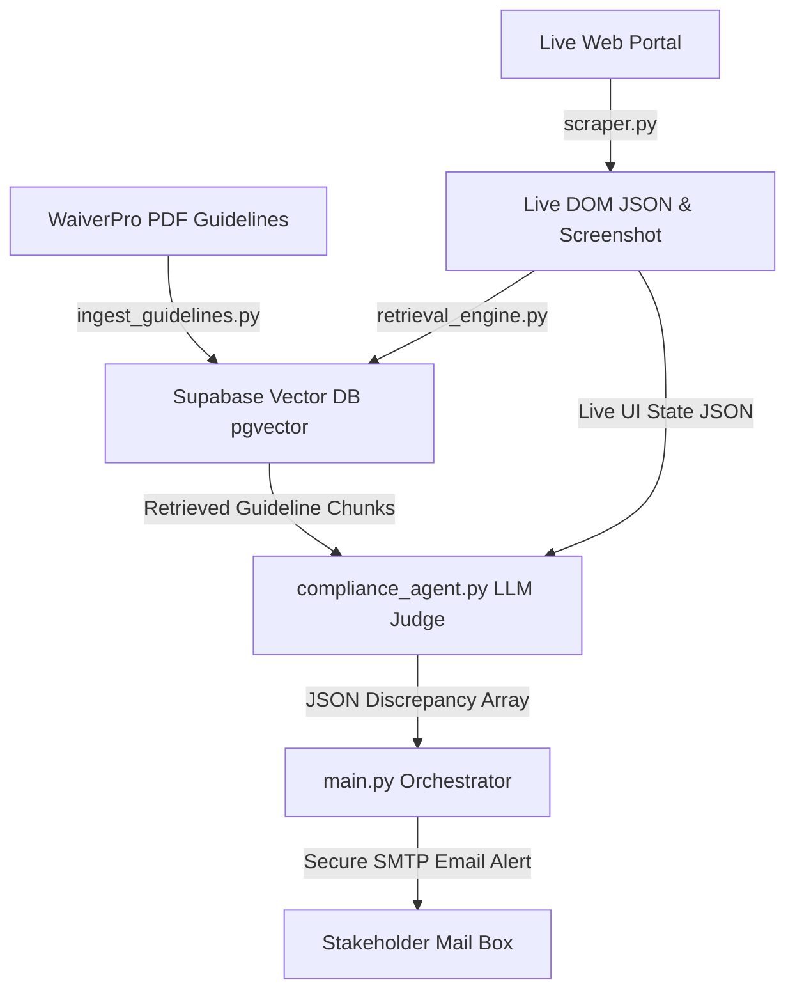

# WaiverPro Documentation Compliance Automation Agent

A production-ready Python compliance automation system that automatically verifies if a live web application conforms to its official design and functional guidelines. The system ingests a guideline PDF document, indexes it into a Supabase Vector DB (pgvector), crawls the live web portal's UI views using a headless browser, retrieves relevant rules via RAG, audits pages for discrepancies using an LLM compliance judge, and sends secure SMTP email alerts with styled HTML summaries and screenshots.

---

## 📐 Core Architecture & Components



The system is decoupled into the following modular files:
1. **`database_setup.sql`**: PostgreSQL database schema script to enable the vector extension, create `guideline_embeddings`, compile an HNSW index, and define the `match_guidelines` similarity RPC function.
2. **`ingest_guidelines.py`**: Ingests guidelines text from the PDF, splits them by page/headers, computes 384-dimensional vector embeddings via `sentence-transformers/all-MiniLM-L6-v2`, and uploads them to Supabase. Fully idempotent.
3. **`scraper.py`**: Controls Playwright headless browser navigation, logs in to the authenticated portal view, captures live page DOM layout structures into structured JSON, and saves PNG screenshots.
4. **`retrieval_engine.py`**: Encodes active page states, queries Supabase using the `match_guidelines` RPC, and retrieves the most relevant guideline text segments.
5. **`compliance_agent.py`**: RAG compliance judge. Connects to the Hugging Face Serverless Inference API running `Qwen/Qwen2.5-7B-Instruct` (optimized for CPU-only systems to prevent OOMs), evaluates page elements against guidelines, and outputs verified discrepancy JSON reports.
6. **`main.py`**: Master orchestrator. Sweeps all configured pages, compiles findings, embeds color-coded tables in an HTML alert, and mails it securely using STARTTLS.

---

## 🚀 Setup & Installation

### 1. Prerequisites
- Python 3.10+
- A Supabase Project
- A Hugging Face account and Access Token

### 2. Environment Setup
Clone the repository and initialize the Python virtual environment:
```bash
# Clone the repository
git clone https://github.com/karnamvenkatachaitanya/Novulis.git
cd Novulis

# Create and activate virtual environment
python -m venv venv
.\venv\Scripts\activate

# Install dependencies
pip install -r requirements.txt
playwright install chromium
```

### 3. Supabase Schema Setup
1. Go to your [Supabase SQL Editor](https://supabase.com/dashboard/).
2. Copy the content of **[`database_setup.sql`](database_setup.sql)**, paste it into the editor, and click **Run**.

### 4. Configuration
Create a `.env` file in the root directory:
```env
# Live Web Portal
APP_BASE_URL=https://white-cliff-0bca3ed00.1.azurestaticapps.net
APP_LOGIN_PATH=/login
APP_LOGIN_EMAIL=admin@gmail.com
APP_LOGIN_PASSWORD=password

# Supabase Vector DB
SUPABASE_URL=https://klbidsgkllnsrijszzas.supabase.co
SUPABASE_KEY=your_publishable_anon_key
SUPABASE_SERVICE_ROLE_KEY=your_secret_service_role_key

# Hugging Face token (for Inference API client)
HF_TOKEN=your_hugging_face_token

# Email Server (SMTP Gmail Example)
SMTP_HOST=smtp.gmail.com
SMTP_PORT=587
SMTP_USERNAME=your_gmail@gmail.com
SMTP_PASSWORD=your_gmail_app_password
ALERT_FROM=your_gmail@gmail.com
ALERT_TO=your_gmail@gmail.com
```

---

## 🛠️ Usage Instructions

### Step 1: Ingest Guidelines
Parse and upload the official PDF guidelines into Supabase:
```bash
python ingest_guidelines.py --pdf WaiverPro-User-Guidelines-WITH-DISCREPANCIES.pdf --verbose
```

### Step 2: Execute Orchestrated Compliance Sweep
Run the end-to-end scraper, RAG retrieval, AI auditing, and email alert pipeline:
```bash
python main.py --similarity-threshold 0.0 --smtp-starttls --verbose
```

---

## 📐 Design Decisions & Trade-offs
- **Hybrid Similarity Filtering**: The `match_guidelines` RPC filters chunks strictly matching the active page's `url_path` before checking cosine similarity, ensuring the AI only reviews guidelines written for that specific page.
- **Serverless HF Inference API**: Switched local Mistral 7B loading to Hugging Face Serverless Router running `Qwen/Qwen2.5-7B-Instruct`. This prevents heavy local memory allocation and runs efficiently in seconds on CPU-only machines.
- **STARTTLS with Increased Mail Timeout**: Increased mail client timeout to `300` seconds to guarantee heavy emails (containing 9 high-resolution PNG screenshot attachments, total ~10MB) send cleanly without getting dropped.

---

## ⚠️ Limitations & Future Improvements
- **Shadow DOM support**: The current custom element extractor parses standard page structures but would require extensions to inspect shadow roots.
- **Multi-step Form Auditing**: Current scraper targets static tab views; a future enhancement would support form-filling walkthroughs (e.g. submitting a new waiver application in-page).
